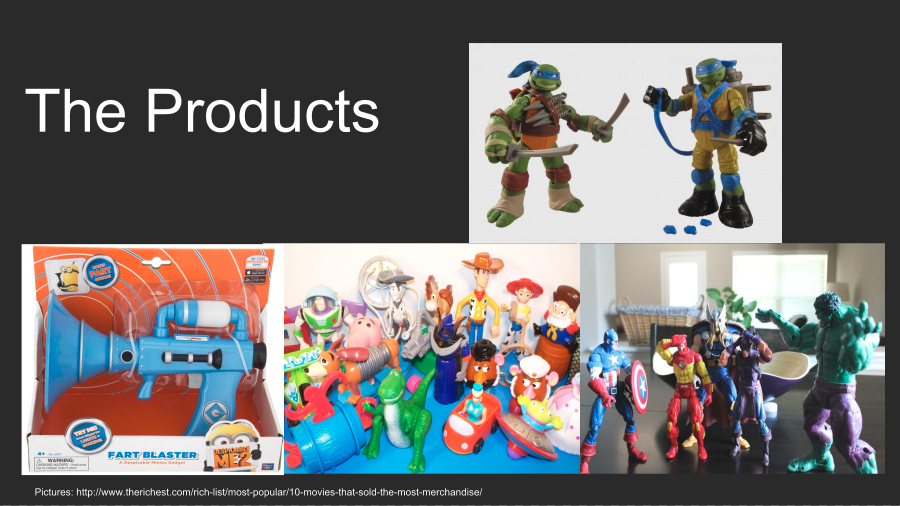

# Movie Grossing Prediction
Merchandising the Movies: Built a model to help the merchandising sector quickly analyze and better predict the success of a movie based on rating, production budget, runtime, etc. to further determine if it will be a successful movie benefiting from increased merchandising production.

## Presentation ##
The presentation is available to view [here](./Merchandising the Movies - Project 2.pdf).

## Blog Post ##
Click [here](asgrunwald.github.io/A-Night-at-the-Movies/) to view a blog post about the project.
